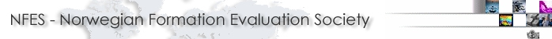

        
        

            The Norwegian Formation Evaluation Society (NFES) is your local Norwegian chapter
            of the <a target="_blank" href="http://www.spwla.org/">SPWLA</a>. The purpose of
            the society is to contribute to the development of the science of Formation Evaluation
            in Norway. This is mainly achieved through the arrangement of monthly technical
            meetings (including lunch) and organising seminars on selected subjects. These arrangements
            give you an opportunity to meet with colleagues from oil and service companies,
            universities and research institutes to discuss matters of common interest. In addition,
            the NFES Fund finances research projects, supports publications and awards members
            who publish papers or make particularly strong contributions to the development
            of Formation Evaluation. So, if you want to take part in all this, renew your membership,
            or <a href="/signup.html">apply for membership</a> already today.

        <table class="table">
            <tbody><tr>
                <th>
                    Our Address:
                </th>
                <th>
                    Our Account Number
                </th>
            </tr>
            <tr>
                <td>
                    POSTBOKS 561, MADLA, N-4090 HAFRSFJORD, NORWAY
                </td>
                <td>
                    3206.17.03119
                </td>
            </tr>
        </tbody></table>
    
